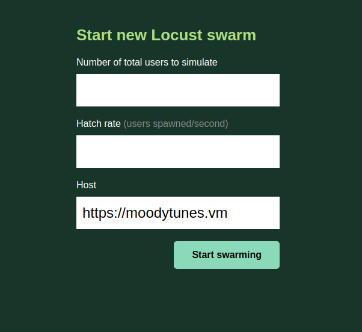

# crucible
Testing facilities for MoodyTunes. This repository will house all the code needed to test the MoodyTunes
application.

## Load Testing

We use [locust](https://locust.io/) for load testing MoodyTunes. This allows us to simulate high
volume traffic against our application.

### Installation

1. Install the Python3 dev package for installing the locust library

`sudo apt-get install python3-dev`

2. Create a virtual environment in the repository directory and activate it

```shell script
virtualenv -p $(which python3) venv
source venv/bin/activate
```

3. Install the requirements

`(venv) pip install -r requirements.txt`


### Running Locust

To run the locust load simulator, run the `locust` command from the repository directory passing a locustfile as an
argument with the `-f` argument.

`(venv) locust -f locustfiles/<locustfile>.py`

This will start the locust server on port 8089 of the machine running locust. Next, navigate to `localhost:8089` in a
webbrowser to view the locust interface. You should see a page that looks like this:



This is the interface used to interact with the locust specific configuration. A breakdown is as follows:

- The `Number of total users to simulate` input represents the number of users that locust will use in its load testing.
This will determine how many users locust will create for its run.
- The `Hatch rate` input represents how long locust will wait until creating a new user for testing. This determines
the rate at which locust will create new users for its pool in sending requests.
- The `Host` input signifies the host to make requests to when running the locust tests. This should always be
`https://moodytunes.vm` as we want to run tests against a local instance of MoodyTunes.
